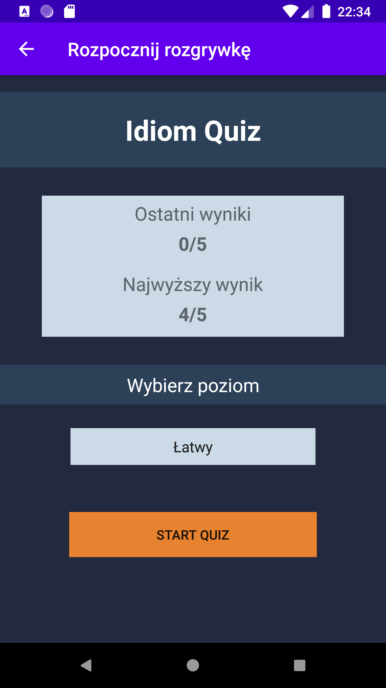

# English idioms quiz

Application for android devices implemented as part of engineering work.

<strong>
The application installer is in the english_idioms / install app directory, 
  just download it to your mobile device :)
</strong>
 

The application connects to a database located on the cloud - firebase.

The application works offline.

The application, depending on the language set in the phone settings, sets the application language to English or Polish.

In the new game section, after selecting the gameplay level, English idioms are displayed in the form of a quiz. The user must indicate the appropriate answer from among the three selected within the given time. After each question, the answer result is saved. The question may be added to the revision board.

  
  
  

There are three levels of advancement, in the first, the easiest answer is in Polish. In the middle level, the answers are displayed in English. In the most difficult level, the answers are in English, you cannot see the content and the idiom, only the voice of the teacher is heard.

With each question, the voice of the teacher reads the content of the idiom, the user can click the speaker multiple times.

  
  
  

The user can go to the repetition table, idioms with a supported answer in Polish and English are displayed here and a picture referring to the idiom is shown, here is also the voice of the teacher.

  

The user has access to his statistics.

  

The user has access to the application settings, selects the number of questions in the game, the speed of the voiceover, and the voice of the teacher.

  

The application has an administrator panel, authorization is done using firebase authorization. The administrator can display all idioms from the database, edit the idiom, delete and add a new one along with adding an image for the idiom to the database.

  
  

  
  
  

  
  

